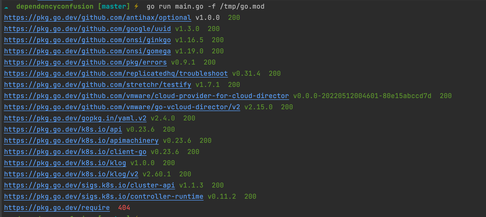

DependencyConfusion is tool used for finding any library used by the project that might be vulnerable to dependency confusion attack. 
	
	Project with following languages supported:
	- Golang
	- python (still in progress)
	- c/c++ (still in progress)

	Flags:
		-u, --url  provide github go.mod raw url
    -f, --file path to local module file
		-v, --verbose  Print verbose logs to stderr.

sample usage:

For remote project: go run main.go -u URL_HERE

For local project: go run main.go -f /tmp/myproject/go.mod

